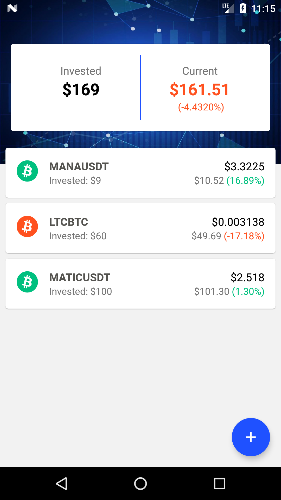
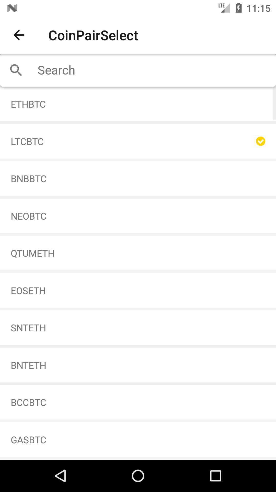
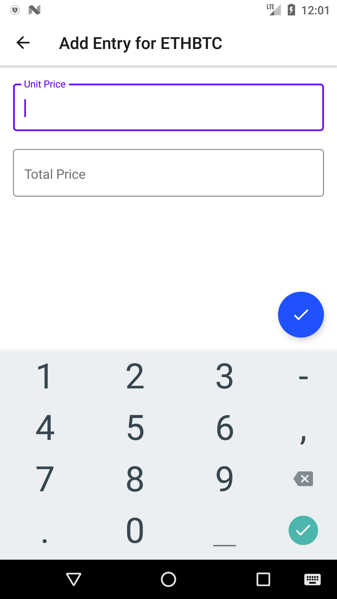
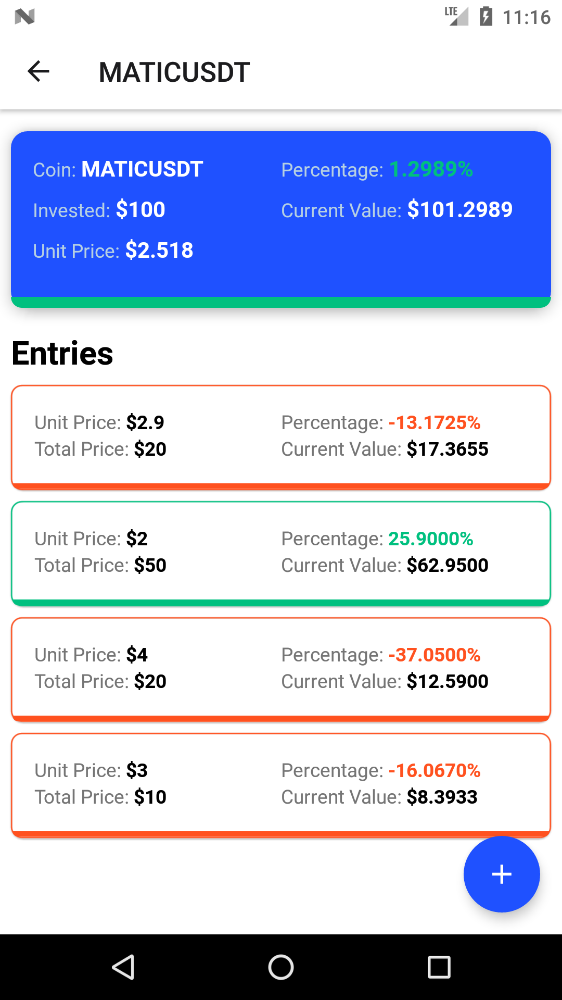

# Crypto Tracker

React Native application for tracking(profit/loss) crypto trades at transaction level. Using [binance api](https://binance-docs.github.io/apidocs/spot/en/#general-info).

## Installation
1. [Setup the react native enviornment](https://reactnative.dev/docs/environment-setup).(React native CLI)
2. Clone the repository. `git clone https://github.com/gokulp-rn/crypto-tracker-rn.git`
3. Change directory in your local to the cloned folder.
4. Run `yarn install` to install the packages.

### To run the android app
1. Run `npx react-native run-android` to build.
2. Run `npx react-native start` to start the metro bundler.
   
### To build apk
1. Run `npm run android:assemble` 
>This will build an apk file in location `<project folder>/android/app/build/outputs/apk/release/app-release.apk`)

## Screenshots
<table>
  <tr>
     <td>Home Screen</td>
     <td>Coinpair Select Screen</td>
  </tr>
  <tr>
    <td></td>
    <td></td>
  </tr>
  </table>
  <table>
  <tr>
     <td>Add Entry Screen</td>
     <td>Coin Details Screen</td>
  </tr>
  <tr>
    <td></td>
    <td></td>
  </tr>
 </table>